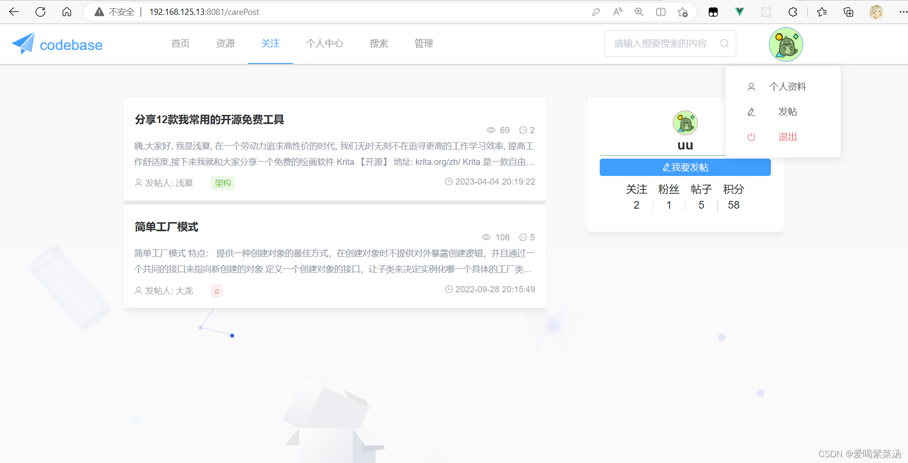

编程社区
(富文本发帖、资源分享、多级评论、收藏、点赞)

springboot+mybatisPlus+vue2+elementUi

运行：

所需环境：jdk1.8、Mysql、Redis、Maven、Node.js、Git

下载代码
```
git clone https://github.com/zhouhw0306/forum-bs
```
前端启动
```
npm install
npm run serve
```
后端启动
```
mvn spring-boot:run
```
# 项目亮点

1. 实现基于用户的协同过滤算法
2. 使用前缀树结构实现敏感词过滤
3. Aop+redis+自定义注解,实现接口权限校验、限流、重复提交验证
4. 使用JWT生成token实现登录验证
5. 集成MarkDown插件实现图片上传、代码高亮等
6. 集成Github授权登录oAuth2.0方式
7. 使用七牛云对象存储
# 展示

# 系统功能模块图

